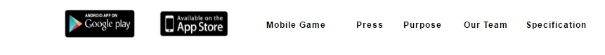

# 主頁面

請參照index.html 主頁面

一般來說直接對照公司網址可以得知路徑與目錄位置

http://www.leap-leaf.com/index.html <---- 這是在指www底下的index.html

基礎語法請參考w3c school這個網站

底下頁面框架為footer 請參考連結 
<iframe src="./mycard_files/footer.html" width="100%"  marginwidth="0" marginheight="0" scrolling="no" frameborder="0" align="center" >

如果要更改字形大小可以從CSS或是pixo去更改，純改字形請改CSS

連結與字形的增加方式可以參考Press.html

